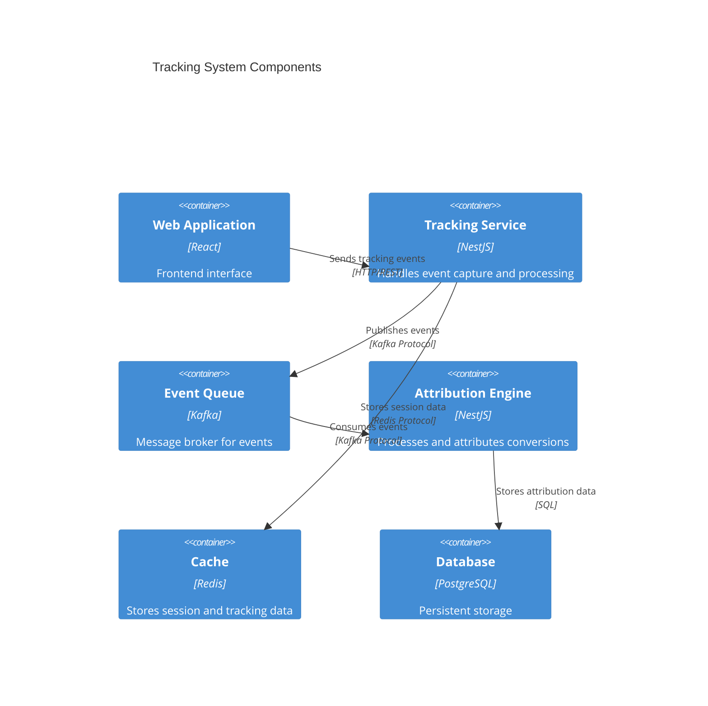
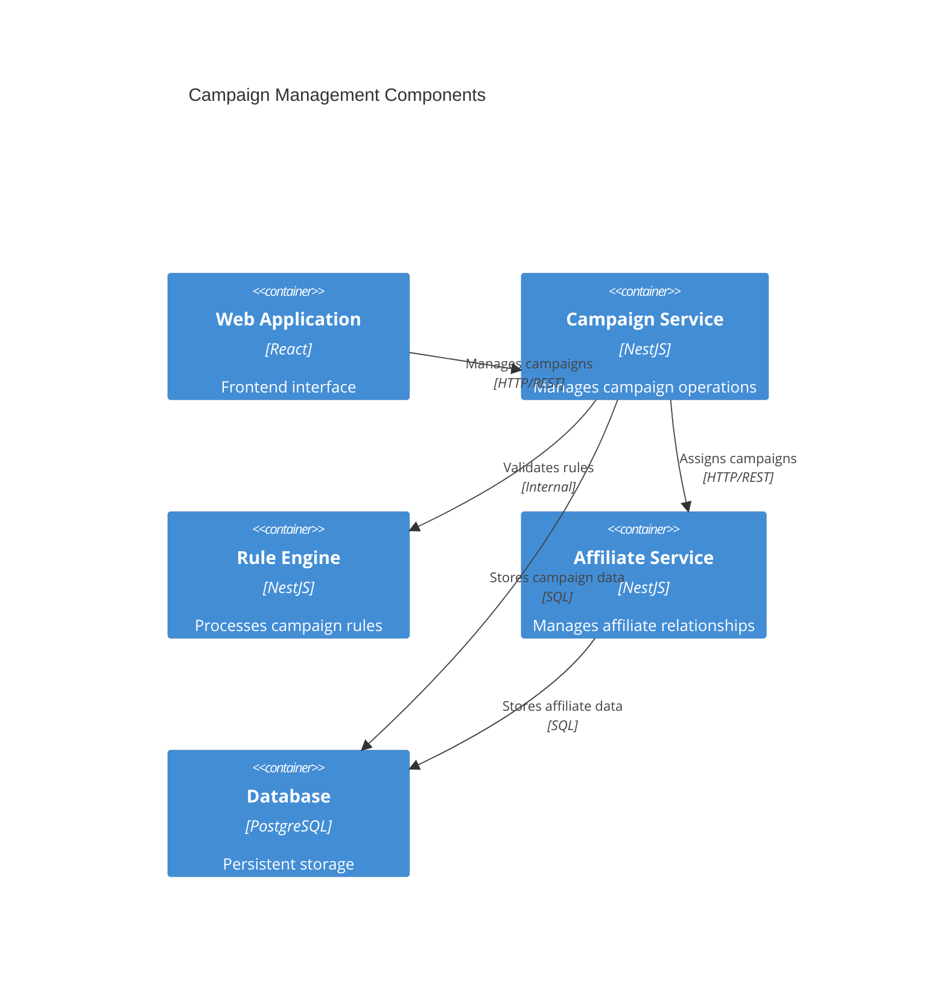
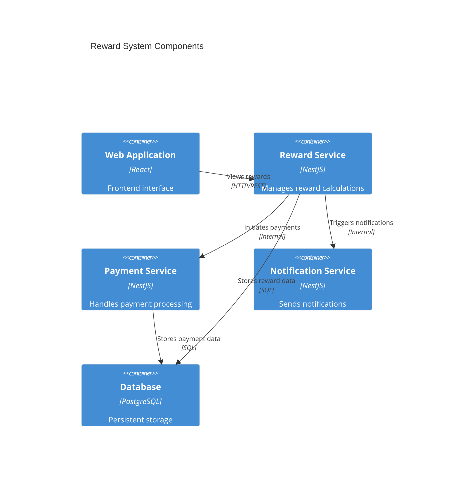

# Component Diagrams

## 1. Tracking System Components

### Key Components

1. **Tracking Service**
   - Cookie Management
   - Fingerprint Generation
   - Click Fraud Detection
   - Event Validation

2. **Attribution Engine**
   - Multi-touch Attribution Logic
   - Conversion Window Management
   - Duplicate Detection
   - Attribution Rules Processing

## 2. Campaign Management Components

### Key Components

1. **Campaign Service**
   - Campaign CRUD Operations
   - Campaign Validation
   - Campaign Status Management
   - Performance Tracking

2. **Rule Engine**
   - Commission Rules Processing
   - Eligibility Validation
   - Constraint Checking
   - Dynamic Rule Evaluation

## 3. Reward System Components

### Key Components

1. **Reward Service**
   - Commission Calculation
   - Reward Rules Processing
   - Performance Bonuses
   - Reward Status Management

2. **Payment Service**
   - Payment Processing
   - Payment Gateway Integration
   - Transaction Management
   - Payment Status Tracking

## Integration Points

1. **Cross-Component Communication**
   - Event-driven architecture using Kafka
   - RESTful APIs for synchronous operations
   - Redis for caching and real-time data

2. **Data Flow**
   - Tracking events flow through Kafka
   - Campaign data accessed via REST APIs
   - Reward calculations triggered by conversions

3. **Security Integration**
   - JWT authentication across services
   - Role-based access control
   - API key management for external integrations

## Scalability Considerations

1. **Component Scaling**
   - Each service independently scalable
   - Stateless design for horizontal scaling
   - Cache layer for performance optimization

2. **Data Management**
   - Database sharding strategy
   - Read replicas for high-traffic components
   - Event sourcing for tracking data

## Monitoring Integration

1. **Service Health**
   - Component-level health checks
   - Performance metrics collection
   - Error rate monitoring

2. **Business Metrics**
   - Conversion tracking accuracy
   - Campaign performance metrics
   - Payment processing success rates